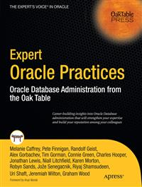

#Apress Source Code

This repository accompanies [*Expert Oracle Practices*](http://www.apress.com/9781430226680) by Pete Finnigan, Alex Gorbachev, Tim Gorman, Charles Hooper, Jonathan Lewis, Niall Litchfield, Robyn Sands, Joze Senegacnik, Riyaj Shamsudeen, Jeremiah Wilton, Graham Wood, Connie Green, Karen Morton, Randolf Geist, Uri Shaft, Melanie Caffrey, Andrew Morton, Tom Green, Paul Wilton, and Joe Lewis (Apress, 2010).

Download the files as a zip using the green button, or clone the repository to your machine using Git.

##Releases

Release v1.0 corresponds to the code in the published book, without corrections or updates.

##Contributions

See the file Contributing.md for more information on how you can contribute to this repository.
